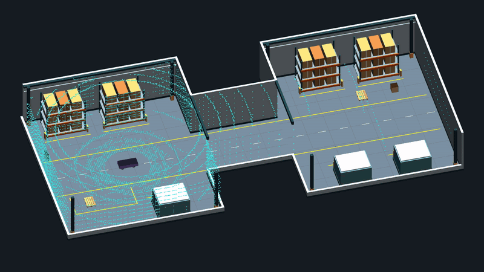
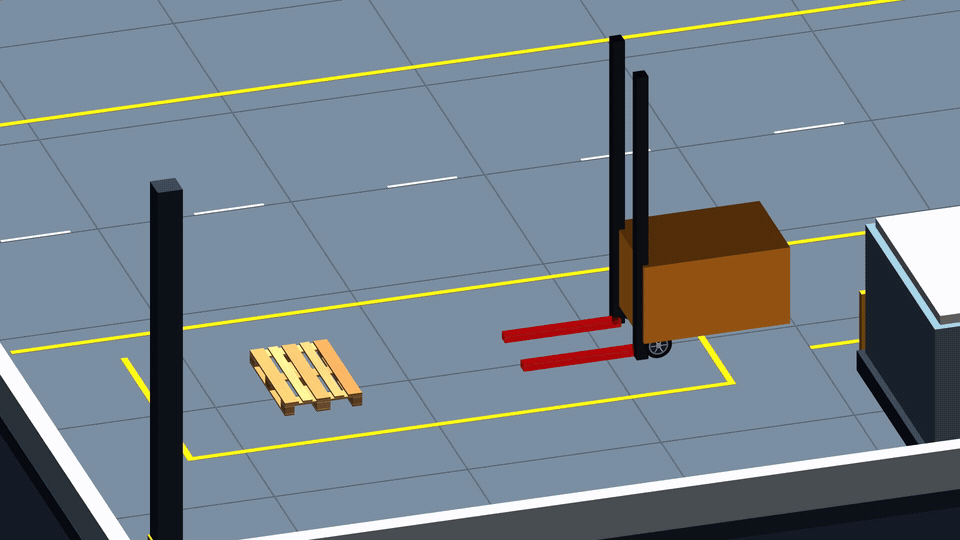

<p align="center">
  
</p>

ROS 2 Humble extensions to [Avidbots Flatland](https://github.com/avidbots/flatland),
developed by [Levent Soysal (Worthle)](https://github.com/Worthle).

<table>
  <tr>
    <td></td>
    <td></td>
  </tr>
</table>


## New Plugins

- **Drives:** `DiffDriveCaster`, `TricycleDriveAckermann`, `OmniDrive`, and
  `SystemIdDrive` for identified NARX dynamics. `DiffDrive` supports OE response models.
- **Forks and payloads:** `Forklift`, `LinkAttacher`, and `ForkController`.
- **Sensors:** `MockLidar3D`, and `MockDetection`; additional body and
  elevation filters for `Laser`.
- **Terrain:** `TerrainModifier` for slip, drift, rubble, and slope effects.

See the [plugin reference](docs/included_plugins/plugin_catalog.rst) for parameters,
topics, and YAML examples.

## Visualization

Body extrusion, elevation, mesh visuals, animated wheels, raised forks and
payloads, and RViz2 spawn/pause tools. The visualization application discovers
Flatland debug displays automatically.

See [visualization](docs/visualization.rst) for configuration. Physics remains
planar; height and 3D sensor outputs do not add 3D rigid-body dynamics.


## Build

### Docker

From this repository:

```bash
docker build -t flatland2:latest .
```

### ROS 2 workspace

On Ubuntu 22.04 with ROS 2 Humble, place this repository under your workspace's
`src/` directory. Place `flatland_examples` beside it to run the example robots.
From the workspace root:

```bash
source /opt/ros/humble/setup.bash
rosdep install --from-paths src --ignore-src -r -y
colcon build
source install/setup.bash
```

Example runtime dependencies, including the Nav2 map server, are included in the
Flatland package dependencies and Docker image.

## Run

For the example robots and keyboard controls, see
[flatland_examples](../flatland_examples/README.md).

To load your own world after sourcing the workspace:

```bash
ros2 run flatland_server flatland_server --ros-args -p world_path:=/absolute/path/to/world.yaml
```

[License](LICENSE) · [Third-party notices](flatland/THIRD_PARTY_NOTICES.md) ·
[Contributing](CONTRIBUTING.md)
