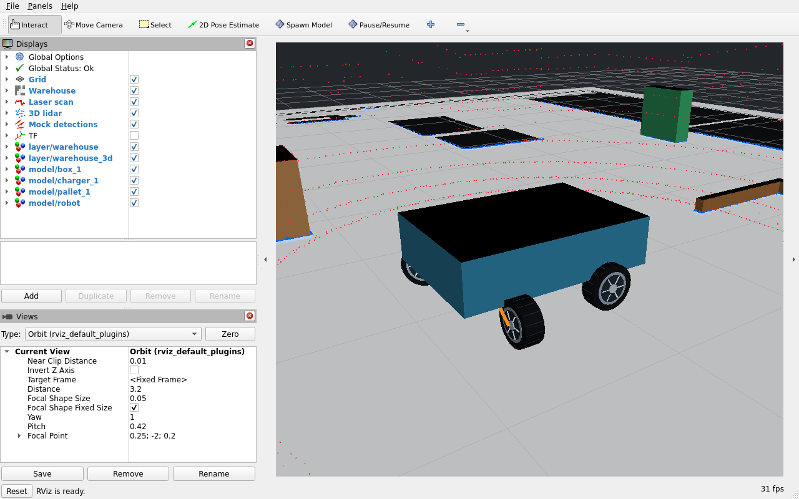

# Flatland 2

Flatland 2 is a community-maintained ROS 2 Humble extension of
[Avidbots Flatland](https://github.com/avidbots/flatland), maintained by
[Levent Soysal (Worthle)](https://github.com/Worthle). It uses the bundled Box2D
engine for 2D robotics simulation, with warehouse demos, additional vehicle
plugins and RViz2 visualization. This is an independent fork, not an official
Avidbots release, and is not affiliated with or endorsed by Avidbots.

The `flatland2` branch starts from upstream `ros2-humble`. Existing ROS package
names remain `flatland*`. See [branch history and scope](UPSTREAM.md),
[publishing instructions](PUBLISHING.md), and [contribution guide](CONTRIBUTING.md).

The runtime targets **ROS 2 Humble** and retains [Flatland-derived](https://github.com/avidbots/flatland) server code alongside this repository's drive models, warehouse operations, and mock sensors.

**The physics is planar.** Vehicle motion, collisions, and dynamics plugins work with planar footprints on Box2D. Its RViz visuals, height effects, mock 3D lidar, and camera detections add 3D presentation and localization inputs around planar vehicle motion.



## Features

- ROS 2 topics, simulation time, robot namespaces, and runtime spawn, move, delete, and pause controls.
- Differential, caster differential, Ackermann, and omnidirectional drives.
- Caster alignment dynamics and terrain patches with slip, drift, vibration, and planar slope effects.
- Forklift lifting, payload attachment, transport, and release.
- 2D lidar, IMU, GPS, bumper, and collision plugins, plus mock 3D lidar and camera detections.
- Direct vehicle dynamics from OE or NARX models, independent of the robot footprint.
- RViz visualization with extruded bodies, rolling wheels, animated forks and loads, and interactive model tools.
- YAML robot models, reusable objects, and keyboard teleoperation.

Tested with **HDL Localization, SLAM Toolbox, AMCL, and OpenTCS through an MQTT bridge**, alongside other AMR packages. [Integration notes](flatland/docs/integrations.md) cover SLAM Toolbox and MQTT/OpenTCS.

## Install and run

Install Docker Engine and the Compose plugin on Linux. No host ROS installation is needed. The launcher uses NVIDIA when available and automatically falls back to CPU rendering; NVIDIA Container Toolkit is needed for Docker to access an NVIDIA GPU.

From this repository, on an X11 desktop or XWayland:

```bash
xhost +si:localuser:root
./docker.sh up --build -d
./docker.sh logs -f flatland
```

This opens the omni robot in the warehouse with RViz. For a headless run, use `SHOW_VIZ=false ./docker.sh up --build -d` and skip `xhost`.

Choose a robot and drive it:

```bash
ROBOT=forklift ./docker.sh up -d
./docker.sh exec flatland /docker-entrypoint.sh ros2 run flatland ackermann_teleop.py
```

| Robot | Description |
| --- | --- |
| `turtlebot` | A compact differential robot. |
| `castor_wheeled_differential_robot` | A differential robot with pronounced caster alignment effects. |
| `omni_drive_robot` | An omnidirectional robot with two steering turrets and two passive casters. |
| `forklift` | An Ackermann vehicle with lifting forks and payload handling. |

Use the script for your drive type with `ros2 run flatland` inside the container:

| Script | Controls |
| --- | --- |
| `diff_teleop.py` | TurtleBot/caster robot: W/X forward/reverse, A/D turn, Q/E/Z/C drive arcs, S or Space stop. |
| `omni_teleop.py` | W/X forward/reverse, A/D strafe, Q/E/Z/C diagonals, J/L rotate, K stop rotation, S or Space stop. |
| `ackermann_teleop.py` | WASD or arrow keys adjust speed and steering, Space brakes, Tab centers steering, Q exits. |

The differential and omni scripts use T/G to adjust both speeds and Y/H for linear speed; U/J adjusts differential turn speed, and U/N adjusts omni turn speed. Ctrl-C stops and exits every script. [Teleop details](flatland/docs/configuration.md#keyboard-control) include namespaces and command behavior.

Stop the simulator with `./docker.sh down`; after closing RViz, revoke display access with `xhost -si:localuser:root`.

Rebuild with `./docker.sh up --build -d` after changing files in the package directories. Set `BUILD_JOBS=1` if build memory is limited. ROS discovery uses host networking and `ROS_DOMAIN_ID=42` by default.

## Topics

These are the main demo interfaces; drive and fork topics depend on the selected robot. Robot topics follow `robot_namespace` when set, while `/map`, `/tf`, `/tf_static`, and `/clock` are shared.

| Topic | What it does |
| --- | --- |
| `/cmd_vel` | Commands forward, lateral, and angular velocity as supported by the drive. |
| `/ackermann_cmd` | Commands forklift speed and steering angle. |
| `/drive/turret{1,2}/command` | Commands each omni turret's wheel speed and steering angle. |
| `/drive/turret{1,2}/measured` | Publishes simulated omni turret states. |
| `/scan` | Publishes a 2D laser scan, shown in blue. |
| `/lidar_points` | Publishes a mock 3D lidar point cloud, shown in red. |
| `/imu/data` | Publishes simulated inertial measurements. |
| `/odom` | Publishes odometry relative to the spawn pose. |
| `/ground_truth/odom`, `/ground_truth/pose` | Publish the robot's true pose in the world frame. |
| `/detections` | Publishes mock object poses in camera coordinates. |
| `/map` | Publishes the 2D occupancy map. |
| `/tf`, `/tf_static` | Publish transforms between world, robot, and sensor frames. |
| `/clock` | Publishes simulation time for ROS nodes using `use_sim_time`. |
| `/flatland_server/debug/topics` | Lists the visualization marker topics for RViz to discover. |
| `/flatland_server/debug/*` | Publish markers for the world, robot bodies, wheels, and joints. |
| `/fork/goal_height` | Commands an absolute fork height in metres. |
| `/fork/height`, `/fork/pose` | Publish the animated fork height and pose. |
| `/fork/goal_reached`, `/fork/loaded` | Report lift completion and payload state. |
| `/fork/attached_model` | Publishes the name of the attached object. |
| `/fork/weight`, `/fork/contact_left`, `/fork/contact_right` | Publish simplified load and capture-point proximity feedback. |

## Maps, robots, and objects

The default maps are taken from the [AWS RoboMaker Small Warehouse World](https://github.com/aws-robotics/aws-robomaker-small-warehouse-world). The matching occupancy map and point cloud live in `flatland/maps/warehouse/`.

You can import your own maps, create robot models with the footprints and plugins you need, and add objects such as pallets or racks. Models are YAML files describing bodies, joints, and plugins; `/spawn_model`, `/move_model`, and `/delete_model` let you change a running scene. Forklift objects can be attached, lifted, and released through `/fork/attach`, `/fork/lift`, and `/fork/detach`.

Use `LOCALIZATION=external ./docker.sh up -d` when a localization stack should publish `map -> odom`. More launch options, map import steps, model configuration, and service details are in the [configuration guide](flatland/docs/configuration.md).

`flatland/` holds the models, maps, objects, launch files, and tools. The simulator packages are sibling directories at the repository root; `flatland_core/` is the metapackage that depends on them.

[Changes from ROS 1](flatland/docs/ros1-comparison.md) · [Validation](flatland/docs/validation.md) · [BSD 3-Clause license](LICENSE) · [Third-party notices](flatland/docs/THIRD_PARTY_NOTICES.md)

[Worthle](https://github.com/Worthle) · <leventfaruksoysal6@gmail.com>
